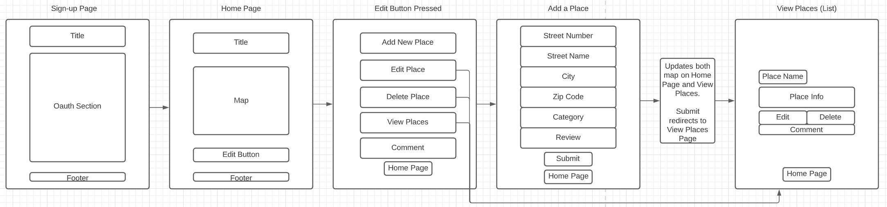
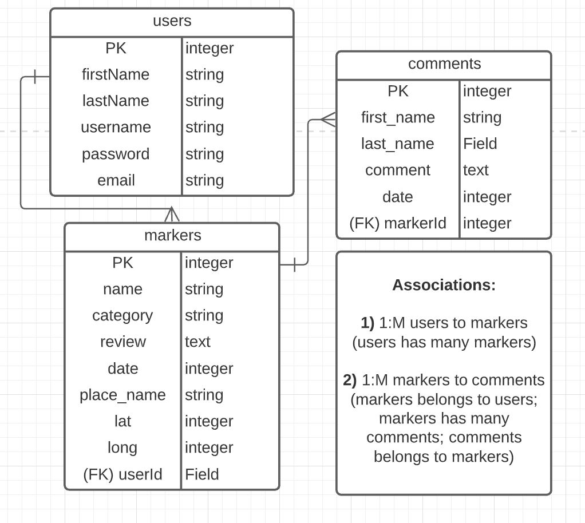
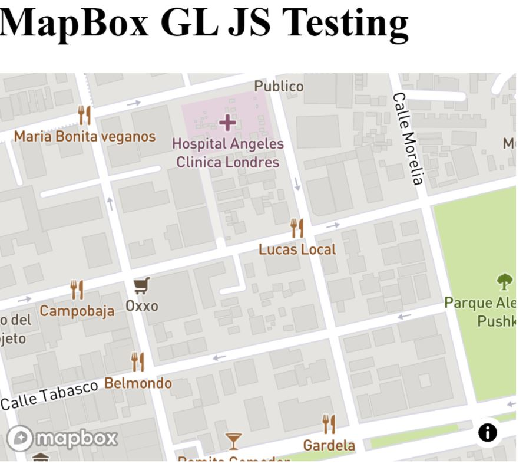
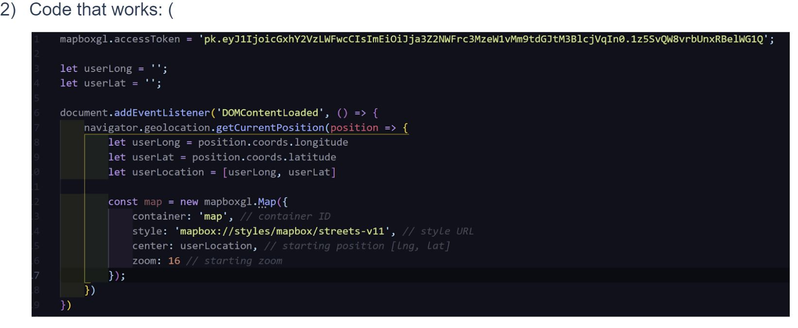
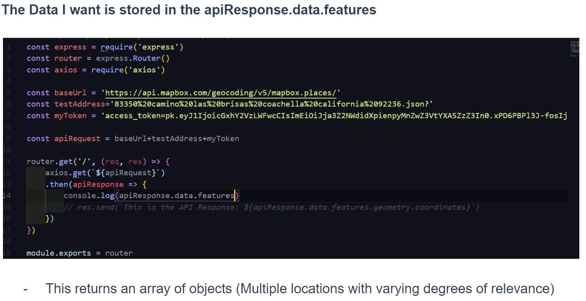
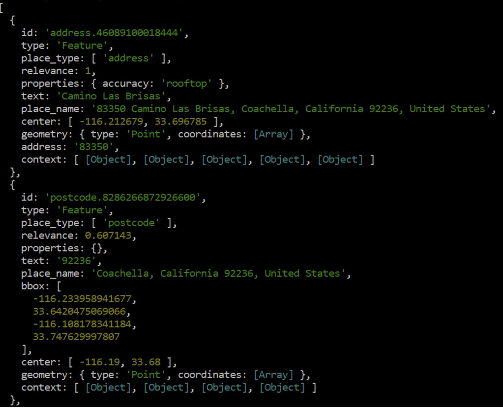

Testing Verified Commits MBpro
# "Places" - Full Stack PEN Application

One stop shop to see the places YOU love.

## Idea:

Users will pin their places based on address using the MapBox API.

Use Cases:
- People can use the application to track places they like (e.g. all their favorite restaurants)
- Nonprofits and government agencies can create a centralized database of all partner agencies providing services to their clients.
- Emergency Mode: Data store of all emergency services in a certain radius based on user location. (Code For America: Reimagining 911 | National Day of Civic Hacking)

*Those markers will have a pop-up with user-generated information*
*This will include the name of the place, a category of the place (e.g. restaurant, bar, music venue, etc.) and a user note.*
*The APP will use 2 APIs:*
     - Geolocation API to generate a user location and center the map upon loading
     - MapBox (forward) Geocoding API to return the coordinates for a given address and to place the marker on the map.
     - The APP will also use the MapBox GL JS open-source graphical library.

## Process:
The user will enter an address to request coordinates from the MapBox Geocoding API to place markers on the map using the MapBox GL JS graphical library.

## Tech Stack:
1. HTML, CSS, JS, Bootstrap, MapBox GL JS, EJS
2. PostgreSQL and Sequelize, Node, Express, Geolocation API, MapBox Geocoding API
3. Authentication: Passport and Bcrypt

## Wireframe and ERD:

## Data:
1. User (First Name, Last Name)
2. User-Generated (Name of Place, Category, Review)
3. Auto-Generated (Date Stamp)
4. API-Generated (Matched Address, Coordinates)

## MVP:
1. User can view, add, update, and delete markers and view the map with markers with popup info.
2. User can see list of their items and related info
3. User can comment on markers

## Stretch Goals
1. Users can view other users pins (critical for sharing reviews)
2. MAP can be clicked to create a pin via a reverse geocode API Request to turn coordinates into an address and store it for future reference.
3. Button that returns you to the current location once you move away from it.
4. User can set the default styling for their map
5. EMERGENCY MODE: ONLY displays emergency services for local Medical, Fire, Police facilities based on a database seeded from a web scraper.

## Potential Roadblocks
1. Validating a user-provided address
2. Returning the most relevant/accurate location from the API response

## Models:
1. User 
- userId (int)
- firstName (str)
- lastName (str)
- userName (str)
- password (str)
- email (str)
2. Marker 
- markerId (int)
- name (str)
- category (str)
- review (text)
- date stamp (date)
- place name (str)
- longitude (float)
- latitude (float)
3. Comment
- commentId (int)
- name (str)
- comment (text)
- date stamp (date)

## MapBox GL JS Successfal Map Integration with GeoLocation API:

## MapBox Forward Geocoding API Success:

## MapBox Forward Geocoding API Response Object:
